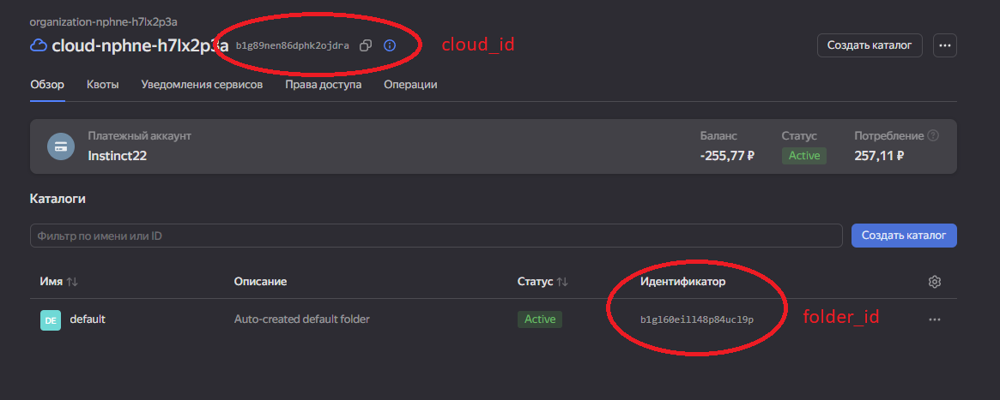

Чтоб сделать импорт нашего инстанса. Необходимо: 
1. В файле default.tf удалить все в resource "yandex_compute_instance" "imported_vm (можете назвать как вам удобно)". 
2. Дальше производим инициализацию terraform init (Производим инициализацию рабочей директории).
3. Производим импорт. terraform import yandex_compute_instance.imported_vm (Либо ваше название в default.tf) (имя инстанса. Его можно получить в UI вашего клауда, либо выполнить команду yc compute instance list в CLI. Тут вы получите весь список ваших инстансов). Пример команды - terraform import yandex_compute_instance.imported_vm fhms6d5rvcpdn7rghr2u
4. Дальше нам необходимо перенести конфигурацию в default.tf. В этом нам поможет команда terraform show > imported_vm.txt
5. Когда получили imported_vm.txt, начинаем перегонять настройки в default.tf секцию resource "yandex_compute_instance" "imported_vm. За пример можно взять default.tf который сейчас есть.


## Python

Для запуска Python-скрипта:

1. В папке `Python/` создать файл `.env`
2. Добавить переменные:

```
OAUTH=ваш_oauth_токен
SSH_KEY=ваш_публичный_ssh_ключ
KEY_PATH=путь_до_приватного_ssh_ключа
```

- **OAUTH** — получить токен можно по [ссылке](https://oauth.yandex.ru/authorize?response_type=token&client_id=1a6990aa636648e9b2ef855fa7bec2fb)
- **SSH_KEY** — ваш публичный ключ (например, `~/.ssh/id_rsa.pub`)
- **KEY_PATH** — путь до приватного ключа (например, `~/.ssh/id_rsa`)

После этого можно запускать скрипт.

---

## Ansible

Чтобы использовать Ansible роли:

1. Перейти в папку `Ansible/`
2. Отредактировать файл `hosts.ini`, указав белый IP вашей ВМ

Получить IP можно двумя способами:
- Через UI в консоли Yandex Cloud
- После выполнения Python скрипта (он выводит IP)

---

## Terraform

Для работы с Terraform:

1. В `default.tf` в блоке `locals` заменить переменные:
```
cloud_id  = "ваш_cloud_id"
folder_id = "ваш_folder_id"
```

Получить их можно в интерфейсе Yandex Cloud (пример на скриншоте)


---

### Импорт инстанса в Terraform

1. В файле `default.tf` удалить содержимое блока:

```hcl
resource "yandex_compute_instance" "imported_vm" {
  ...
}
```

2. Выполнить инициализацию:

```bash
terraform init
```

3. Выполнить импорт инстанса (ID инстанса можно взять из UI или с помощью команды `yc compute instance list`):

```bash
terraform import yandex_compute_instance.imported_vm <instance_id>
```

Пример:
```bash
terraform import yandex_compute_instance.imported_vm fhms6d5rvcpdn7rghr2u
```

4. Получить текущую конфигурацию ресурса:

```bash
terraform show > imported_vm.txt
```

5. Перенести нужные параметры из `imported_vm.txt` в `default.tf`, в блок `resource "yandex_compute_instance" "imported_vm"`.

Можно ориентироваться на уже существующую структуру в `default.tf`. В случае возникновения каких либо проблем всегда можно отталкиваться от результата terraform plan. Он будет подсвечивать что планирует изменить или что не корректно.

---
